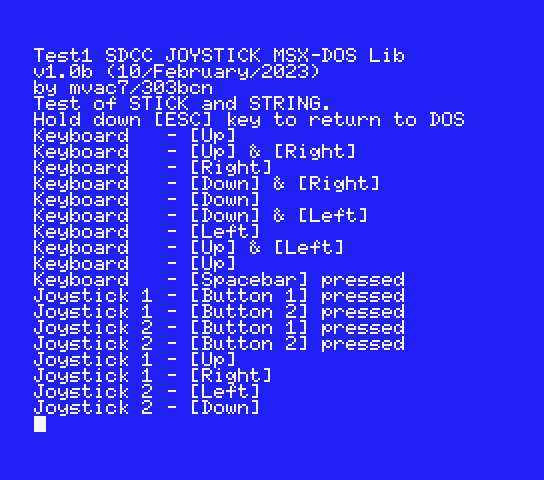
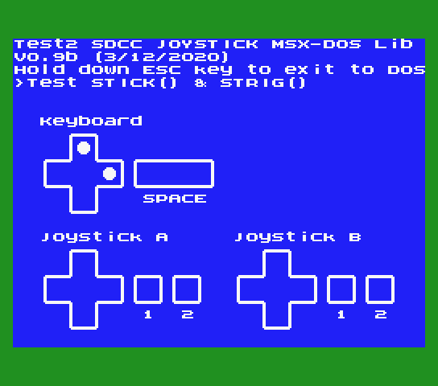

# Joystick MSX-DOS SDCC Library (fR3eL Project)

```
Author: mvac7 (aka aorante)
Architecture: MSX
Format: C Object (SDCC .rel)
Programming language: C and Z80 assembler
```


## Description

Library with basic functions for reading joystick controllers or cursor keys of MSX computers.

This library does not use the MSX BIOS. It reads directly from the internal PSG ports to read the joysticks and from the PPI port to read the keyboard cursor keys. 
It is designed to develop MSX-DOS applications or other formats that do not require the use of the BIOS.

The direction combinations of the game controllers follow the same logic as the BIOS GTSTCK function (UP+DOWN = 0; RIGHT+LEFT=0; UP+LEFT+DOWN = LEFT; DOWN+LEFT+RIGHT = DOWN; etc.).

Use them for developing MSX applications using Small Device C Compiler (SDCC).

This project is an Open Source library. 
You can add part or all of this code in your application development or include it in other libraries/engines.

You can access the documentation here with [`How to use the library`](docs/HOWTO.md).

This library is part of the [MSX fR3eL Project](https://github.com/mvac7/SDCC_MSX_fR3eL).

Enjoy it!   

<br/>

---


## History of versions:
- v2.0 (12/February/2023) Programmed by directly reading the joystick (PSG) and keyboard (PPI) ports.
- v1.0 ( 2/December/2020) first versión. Uses the BIOS routines via interslot calls.

<br/>

---

## Requirements

- [Small Device C Compiler (SDCC) v4.1](http://sdcc.sourceforge.net/)
- [Hex2bin v2.5](http://hex2bin.sourceforge.net/)

<br/>

---

## Functions

| Name | Declaration | Description |
| ---  | ---   | ---         |
| STICK | `char STICK(char joy)` | Returns the joystick status |
| STRIG | `signed char STRIG(char triggerN)` | Returns the trigger status |

<br/>

---

## Examples

In the source code you can find two applications for testing and learning purposes.

### Test 1

Source code and executable of [`TEST1`](examples/TEST1/)

This application shows in Log format, the pulsations of the directions of the game controllers and the cursor keys, as well as the pulsation of the fire buttons and the space key (keyboard).



<br/>

### Test 2

Source code and executable of [`TEST2`](examples/TEST2/)

This application shows on a graphic screen, the pulsations of the directions of the game controllers and the cursor keys, as well as the pulsation of the fire botnoes and the space key (keyboard).

It can be used to test the operation of your joysticks (compatible with the MSX standard).

